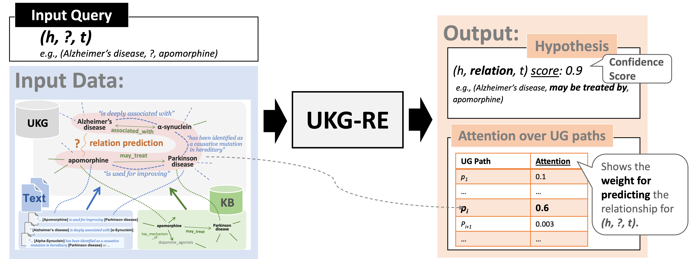

# UKG-RE

This toolkit aims for Relation Extraction (RE) task. Specifically, given a query of entity pair, this toolkit predicts their relation based on the multi-hop paths between them over a Univeral Knowledge Graph (Knowledge Graph triplets + Textual triplets). The implementation is based on our paper "Two Training Strategies for Improving Relation Extraction over Universal Graph" ([PDF](https://arxiv.org/pdf/2102.06540.pdf)). The overall framework is implemented with TensorFlow and Python interfaces so that it is convenient to run the model on GPUs.

### Dependencies
- python = 2.x
- tensorflow = 1.9.0
- numpy
- sklearn
- tqdm
- tabulate
- NetworX

### Usage
1. Prepare Knowledge Grpah triplets (for training e.g., `./data/kg_train.txt` and testing e.g., `./data/kg_test.txt`), Textual triplets (e.g., `./data/tx.txt`) and a file of pretrained word embeddings (e.g., `./data/vec.txt`), as the examples below illustrate.
    - `./data/kg_train.txt`
    ~~~~
    m.09gjxn         people person education        m.02zd2b
    m.0c05l9         business company parent        m.035nm
    m.0mfj2  people person ethnicity        m.044038p
    m.025mq9         people person nationality      m.09c7w0
    ~~~~
    
    - `./data/tx.txt`
    ~~~~
    m.0chgzm        i am a religious man , '' said mr. stevens , who is from [HEAD] , [TAIL] . ''   m.0chghy
    m.0ljsz most of them teach at architecture schools , including [TAIL] and [HEAD] .      m.0z982
    m.030hcs        with julianne moore , [TAIL] , maggie gyllenhaal and [HEAD] .   m.0blt6
    m.01wcp_g       do u wanna ride '' has a smooth [TAIL] beat and a smoother [HEAD] chorus .      m.02l840
    ...
    ~~~~
    - `./data/vec.txt`
    ~~~~
    ...
    different -3.914909 -5.509016 3.511018 ...
    infection -11.192319 -7.395524 -0.078899 ...
    one -2.350216 7.864175 -0.542244 ...
    ...
    ~~~~

2. Preprocess the dataset (e.g., `./data/kg_train.txt`, `./data/kg_test.txt` and `./data/tx.txt`) and store the processed data in specified folders (e.g., `./train_initialized` and `./test_initialized`).

    ~~~~
    python2 preprocess_ug.py \
      --addr_kg_train data/kg_train.txt \
      --addr_kg_test data/kg_test.txt \
      --addr_tx data/tx.txt \
      --addr_emb data/vec.txt \
      --nb_path 10 \
      --cutoff 3 \
      --dir_out_train ./train_initialized \
      --dir_out_test ./test_initialized
    ~~~~
    - `nb_path` is the maximum number of multi-hop paths to search, given an entity pair and a graph (e.g., Knowledge Graph).
    - `cutoff` is th depth to stop the search of multi-hop path.
    
3. Train your own model on the preprocessed dataset. Necessary static configuration (e.g., `HIDDEN_SIZE`) is located in `settings.py`, which is detailed below.
    ~~~~
    CUDA_VISIBLE_DEVICES=1 python2 ukgre.py \
      --mode train \
      --dir_train ./train_initialized \
      --model_dir ./model_saved
    ~~~~
    - `dir_train` is the path to the preprocessed dataset for training.
    - `model_dir` is the path to store the trained model

4. Test the trained model.
    ~~~~
    CUDA_VISIBLE_DEVICES=1 python2 ukgre.py \
      --mode test \
      --dir_test ./test_initialized \
      --model_dir ./model_saved
    ~~~~
    - `dir_test` is the path to the preprocessed dataset for testing.
    - `model_dir` is the path to the trained model.
    

### API USAGE
- Import the script:
  ~~~~
  >>> import ukgre as nn
  ~~~~
- Instantiate the model 
  ~~~~
  >>> model = nn.Model(
                        model_dir='./model_saved',
                        addr_kg_train='data_fb/kg_train.txt',
                        addr_tx='data_fb/tx.txt'
                       )
  ~~~~
  - without any parameters, the default configuration from the `settings.py` will be used:
  ~~~~
  >>> model = nn.Model()
  ~~~~
  
- Then use `infer` to predict the relation given a list of entity pairs via the trained model (e.g., `./model_saved`).
  ~~~~
  >>> list_ep = [('m.09c7w0', 'm.0r89s'), ...]
  >>> results = model.infer(list_ep, nb_path=10, cutoff=3, model_dir='./model_saved')
  ~~~~
  - `nb_path` is the maximum number of multi-hop paths to search, given an entity pair and a graph (e.g., Knowledge Graph).
  - `cutoff` is th depth to stop the search of multi-hop path.
  - `infer` outputs a list of predicted results.
  -  Notice that some entity pairs might lack multi-hop path for predicting their relation, thus `len(results) <= len(list_ep)`.
  
- Check the predicted relation (e.g., `location location contains`) for an entity pair (e.g., `('('m.09c7w0', 'm.0r89s')`) and corresponding confidence score (e.g., `0.5461379`):
  ~~~~
  >>> results[0]["triple_sc"]
  ('m.09c7w0', 'location location contains', 'm.0r89s', 0.5461379)
  ~~~~
  
- Check the supporting multi-hop path evidences and corresponding attention score, where each hop is marked by `<hop>` and `</hop>`, the token `reverse` represents the reverse relation (i.e., (h, r, t) equals (t, reverse r, h).
  ~~~~
  >>> results[0]["path_att"]
  [("<hop1> m.09c7w0 location country first level divisions m.06mz5 </hop1> 
     <hop2> m.06mz5 reverse we have people here from canada , [HEAD] , north and [TAIL] , '' she said . '' m.01n7q </hop2> 
     <hop3> m.01n7q reverse location location containedby m.0r89s </hop3>", 0.030452427), 
  ...]
  ~~~~

### Configuration:
Default settings are located in `settings.py` script. It contains the following configuration parameters:

| parameter | description |
|---|---|
| `CUDA_VISIBLE_DEVICES` | to set the gpu device |
| `TF_CPP_MIN_LOG_LEVEL` | disable tensorflow compilation warnings |
| `DIR_TRAIN` | path to the preprocessed dataset for training |
| `DIR_TEST` | path to the preprocessed dataset for testing |
| `MODEL_DIR` | path to store the trained model |
| `NB_BATCH_TRIPLE` | the number of batch for training KGC model |
| `BATCH_SIZE` | batch size of training Distantly Supervised RE model |
| `TESTING_BATCH_SIZE` | batch size for testing |
| `MAX_EPOCH` | epochs for training |
| `MAX_LENGTH` | the maximum number of words in a path |
| `HIDDEN_SIZE` | hidden feature size |
| `POSI_SIZE` | position embedding size |
| `LR` | learning rate for RE model |
| `LR_KGC` | learning rate for KGC model |
| `KEEP_PROB` | dropout rate |
| `MARGIN` | margin for training KGC model |
| `SEED` | random seed for initializing weights |
| `STRATEGY` | training strategy: none, pretrain, ranking and pretrain_ranking|
| `CHECKPOINT_EVERY` | evaluate and save model every n-epoch |
| `RANK_TOPN` | ranking attention over top or last n complex paths |
| `RESULT_DIR` | path to store the results |
| `P_AT_N`| precision@top_n prediction |
| `ADDR_KG_Train` | address of KG triplets for training, e.g., "e1 tab 'location contain' tab e2 \n" |
| `ADDR_KG_Test` | address of KG trplets for testing |
| `ADDR_TX` | address of textual triplets, e.g., "e1 tab 'lived and studied in' tab e2 \n", where the textual relation can be tokenized by space. |
| `ADDR_EMB` | address of pretrained word embeddings from the Word2Vec, e.g., "cases 4.946734 15.195805 6.550739 2.514410 ... \n" |

